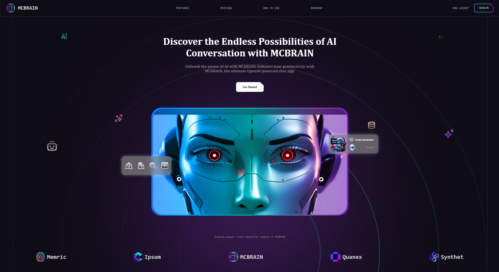

---
## Introduction: 
#### 🔥 Build an AI Landing Page with HTML, CSS & JavaScript | Modern UI, Animations & Parallax Effects!

#### 🔥Build a Modern AI Landing Page with HTML, CSS & JavaScript 🚀 | Responsive & Animate   Want to create a stunning AI landing page with smooth animations, a parallax effect, and a modern, responsive design? In this tutorial, I’ll guide you step by step to build a professional AI-powered website using only HTML, CSS, and JavaScript! 💻✨

#### What You’ll Learn:
#### 🎯 What You’ll Learn:
#### ✅ Responsive Web Design for all screen sizes 📱💻
#### ✅ Smooth Scroll Animations for a dynamic user experience 🎬
#### ✅ Parallax Effect reacting to mouse movement 🖱️
#### ✅ A modern sidebar menu for mobile navigation 📑
#### ✅ High-quality UI with gradient borders & hover effects 🎨
#### ✅ Optimized sign-up page with smooth animations 📝

#### This tutorial is perfect for beginners & advanced developers who want to build eye-catching, interactive websites. Whether you're designing a startup, an AI product, or just want to level up your web skills—this video is for you! 🎯

---
## Watch the full tutorial on YouTub
